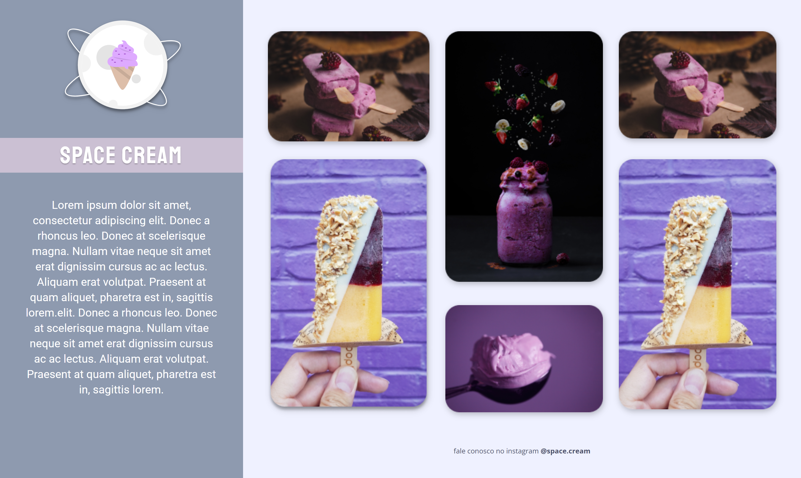

# 🚀 Trilha Explorer

> Desafio SpaceCream concluído!
> Projeto desenvolvido do 0 a partir de um layout no Figma, aperfeiçoando mais os conhecimentos em responsvidade e animações avançadas no CSS!

[🔗Clique para acessar](https://rodkunz.github.io/desafio-spacecream/)

## 🛠 Tecnologias utilizadas

- HTML
- CSS
- Git e Github

## 💻 Contato

raokrodrigo@gmail.com